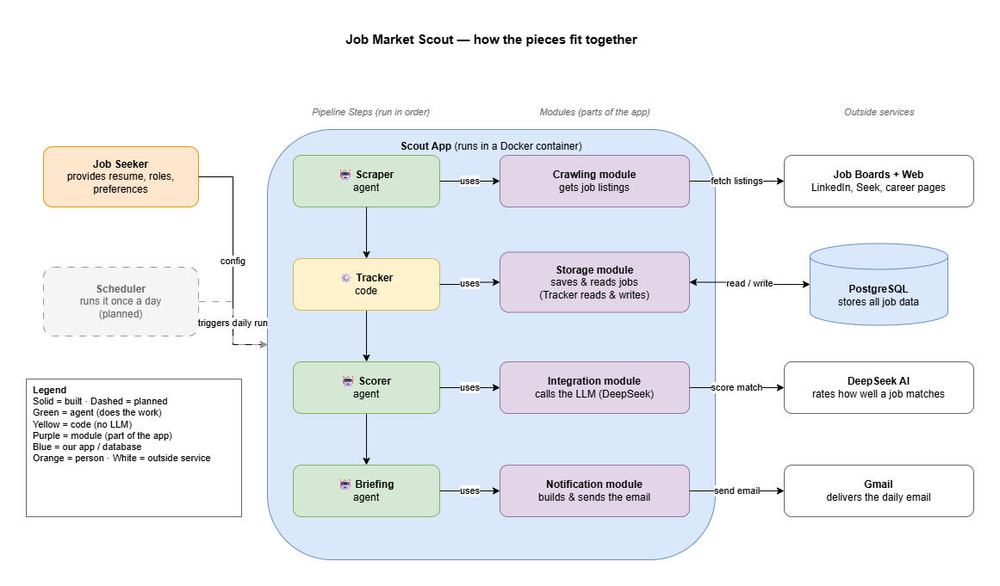
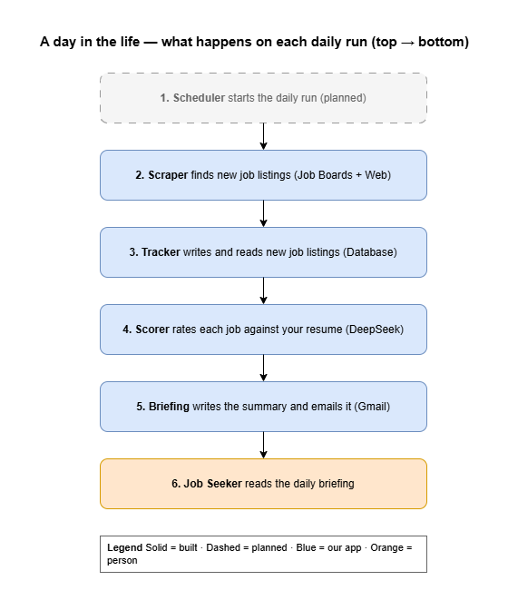

# Product Requirements Specification — Job Market Scout

| | |
|---|---|
| **Version** | 1.0 |
| **Status** | Draft |
| **Author** | Trung |
| **Reviewer** | Anh Phuc |
| **Last updated** | 2026-07-17 |

> **Note for AI coding assistants (Claude Code):** This document is the source of truth for scope, pipeline order, naming, and design decisions. Where code or older documents conflict with this file, this file wins. Key conventions: the matching stage is named **Scorer** (formerly "Matcher" in earlier drafts); the **Tracker is deterministic code, not an LLM agent**; **scores are not persisted in this version**.

---

## 1. Overview

Job Market Scout is a personal, configurable multi-agent system that automates the repetitive part of a job search. Once a day it scrapes job listings from job boards and career pages, detects which listings are new, changed, or closed, scores the relevant ones against the user's resume and preferences using an LLM, and emails the user a concise daily briefing.

The system is generalised: nothing about the pipeline is hard-coded to a specific role or industry. A file-based configuration layer (target roles, keywords, locations, resume, preferences) drives both scraping and scoring, so the same system can scout for any job type by changing config, not code.

### 1.1 Problem statement

Manually checking multiple job boards daily is slow, repetitive, and easy to neglect. Relevant listings get missed, closed listings waste attention, and comparing every listing against a resume is tedious. Job Market Scout compresses this to reading one daily email.

### 1.2 Target user

A single job seeker (initially the author). Single-user by design in this version.

---

## 2. Scope

### 2.1 In scope

- Four-stage pipeline: **Scraper → Tracker → Scorer → Briefing**, run as a Google ADK `SequentialAgent`
- One automated run per day
- Scraping listings from job boards and the web (e.g. LinkedIn, Seek, company career pages)
- Listing lifecycle tracking in PostgreSQL: new / changed / closed, with deduplication
- LLM-based match scoring (DeepSeek via LiteLLM) of relevant listings against the configured resume and preferences
- Daily briefing generated by an LLM and delivered by email (Gmail)
- File-based configuration layer: roles/keywords, locations, resume, preferences

### 2.2 Out of scope (this version)

- Automatic job applications or cover-letter generation
- Embeddings-based matching (scoring is prompt-based via the LLM)
- Market trend analysis
- Teams or other non-email delivery channels
- Multi-user support
- A configuration UI (config is edited as files)
- **Persisting match scores** — see Decision D4

---

## 3. System overview

### 3.1 Pipeline

The Scout App runs as a single containerised process. On each daily run, four stages execute in order, passing data through shared pipeline state (in-memory), not through per-stage database round trips:

- Scheduler (planned) triggers the daily run
- 🤖 **Scraper** → raw listings → ⚙️ **Tracker**
- ⚙️ **Tracker** → relevant / new listings → 🤖 **Scorer**
- 🤖 **Scorer** → listings + scores → 🤖 **Briefing**
- 🤖 **Briefing** → email

🤖 = LLM agent stage · ⚙️ = deterministic code stage

*A day in the life, step by step:*

### 3.2 Stage responsibilities

| Stage | Type | Responsibility | Uses |
|---|---|---|---|
| **Scraper** | LLM agent | Fetch current job listings for the configured roles/locations | Crawling module → job boards + web |
| **Tracker** | Deterministic code | Diff scraped listings against the database; persist all listings; mark each as new / changed / closed; skip duplicates; place the relevant (new/changed) listings into pipeline state for the Scorer | Storage module → PostgreSQL |
| **Scorer** | LLM agent | Rate each relevant listing against the resume and preferences; emit scores + reasoning **keyed by job ID** | Integration module → DeepSeek (via LiteLLM) |
| **Briefing** | LLM agent | Compose the daily summary by joining scores (by job ID) with the listings from Tracker's state key; hand it to the notification module for delivery | Notification module → Gmail |

### 3.3 Modules

- **Crawling module** — retrieves listings from external job boards and career pages
- **Storage module** — all reads/writes to PostgreSQL; used only by the Tracker (single writer)
- **Integration module** — LLM calls (DeepSeek through LiteLLM)
- **Notification module** — builds and sends the briefing email via Gmail

### 3.4 External services

- **Job boards + web** — LinkedIn, Seek, company career pages (listing sources)
- **DeepSeek** — LLM used for scoring and briefing generation, accessed through LiteLLM
- **PostgreSQL** — stores all scraped listings and their lifecycle state
- **Gmail** — delivers the daily briefing email

---

## 4. Functional requirements

| ID | Requirement |
|---|---|
| FR-1 | The system SHALL run the full pipeline (Scraper → Tracker → Scorer → Briefing) once per day when triggered. |
| FR-2 | The Scraper SHALL fetch job listings from the configured sources for the configured roles, keywords, and locations. |
| FR-3 | The Tracker SHALL persist **all** scraped listings to PostgreSQL, not only relevant ones. |
| FR-4 | The Tracker SHALL detect and skip duplicate listings. |
| FR-5 | The Tracker SHALL mark each stored listing's lifecycle state as new, changed, or closed by diffing against prior runs. |
| FR-6 | The Tracker SHALL pass the relevant (new/changed) listings to the Scorer via pipeline state. |
| FR-7 | The Scorer SHALL score each relevant listing against the configured resume and preferences using the LLM, producing a score and short reasoning keyed by job ID. |
| FR-8 | The Scorer SHALL NOT restate or copy listing content; listing data flows to the Briefing stage from Tracker's pipeline state, and the Briefing joins scores to listings by job ID. |
| FR-9 | The Briefing SHALL generate a concise daily summary of the top-matching listings, including at minimum title, company, link, and score for each. |
| FR-10 | The Notification module SHALL send the briefing to the user's email address via Gmail. |
| FR-11 | All scraping and scoring behaviour SHALL be driven by the file-based config (roles/keywords, locations, resume, preferences) with no role-specific logic in code. |

---

## 5. Key design decisions

| ID | Decision | Rationale |
|---|---|---|
| **D1** | Tracker is a deterministic code stage, not an LLM agent. | Diffing, deduplication, and persistence are exact operations; an LLM adds cost and failure modes with no benefit. |
| **D2** | Single writer per table: only deterministic code (the Tracker, via the Storage module) writes to the database. LLM stages produce content only. | Prevents corrupt or hallucinated data reaching storage; keeps write paths auditable. |
| **D3** | Listing data never round-trips through an LLM. The Scorer emits only scores + reasoning keyed by job ID; the Briefing joins these with the original listings from pipeline state. | LLMs cannot be trusted to copy URLs, titles, or fields verbatim; joining by ID guarantees the briefing contains real listing data. |
| **D4** | Match scores are **not persisted** in this version. Scores live only in pipeline state for the duration of a run. The previously planned `matches` table (and its `config_version` correlation) is deferred. | Simplifies the schema for a daily-briefing use case. Because scores are keyed by job ID (D3), a persistence step can be added after the Scorer later without redesign. Trade-off accepted: no score history, and a crash between Scorer and Briefing loses that run's scoring work. |
| **D5** | Configuration is file-based; no config UI. | Single-user tool; files in the repo are simpler and versionable. |
| **D6** | Naming: the matching stage is called **Scorer**. Earlier drafts used "Matcher"; all documents and code should use Scorer. | Consistency across SDLC artifacts and code. |

---

## 6. Non-functional requirements

| ID | Requirement |
|---|---|
| NFR-1 | The application SHALL run as a single Docker container. |
| NFR-2 | A full daily run SHALL complete unattended (no interactive input). |
| NFR-3 | LLM usage SHALL be limited to relevant (new/changed) listings to control API cost — unchanged listings are not re-scored. |
| NFR-4 | Secrets (DB credentials, LLM API key, Gmail credentials) SHALL NOT be committed to the repository; they are supplied via environment variables. |
| NFR-5 | The database schema SHALL target PostgreSQL. |

---

## 7. Deployment & operations

| Component | Status |
|---|---|
| Scout App code + Dockerfile (repo) | **Built** |
| PostgreSQL (provisioned instance) | Planned |
| Scheduler (daily trigger) | Planned — target: cron/systemd timer on the Azure VM |
| Cloud host | Planned — Azure VM instance |
| CI/CD | Planned — GitHub Actions builds the container image and deploys it to the Azure VM on push, gated on the pipeline running successfully |

Source is hosted on GitHub. Until the scheduler exists, runs are triggered manually.

### Development environment

- Python, managed with `uv`
- Developed on Windows (PowerShell)
- Google ADK (`SequentialAgent`) for pipeline orchestration; LiteLLM for the DeepSeek integration
- Local runs via Docker

---

## 8. Deferred / future work

- `matches` table persisting scores + reasoning, correlated to config via a `config_version` hash (schema direction already agreed; deferred per D4)
- Scheduler, Azure VM hosting, CI/CD (see §7)
- Embeddings-based matching
- Trend analysis over stored listings
- Additional delivery channels (e.g. Teams)
- Multi-user support and a config UI

---

## 9. Related documents

- Architecture diagrams: `job-market-scout-simplified.drawio` (pages: High-Level Architecture, User Journey, Deployment)
- Project plan and MoSCoW feature list (kept in sync with this PRS; on conflict, this PRS wins)
